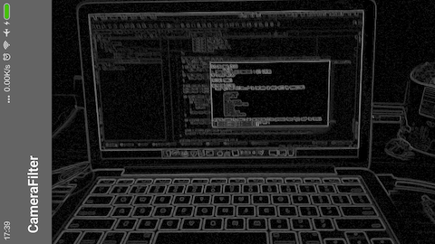

<<<<<<< HEAD
Utilities for dealing with webcam input in WebGL

Single Camera Demo: https://code.zebradog.com/camera/

Multiple Camera Demo: https://code.zebradog.com/camera/multiple.html
(tested with two cameras)

FX provided by glfx.js (https://evanw.github.io/glfx.js/): http://code.zebradog.com/camera/fx.html
=======
# CameraFilter

Realtime camera filters. Process frames by OpenGL shaders.

## Filters

- **[Edge Detection](https://www.shadertoy.com/view/Xtd3W7#)**

>>>>>>> Initial commit
